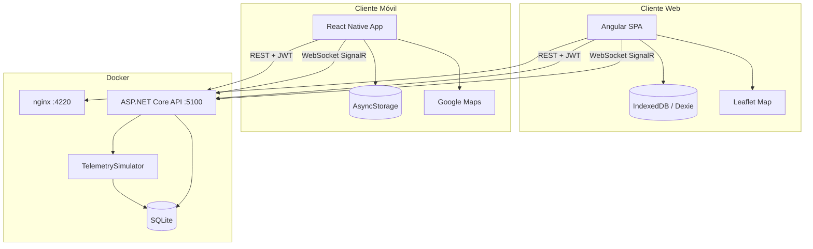

# Sistema IoT de Monitoreo de Flotas Vehiculares


**Simon Movilidad** — dashboard en tiempo real con telemetría simulada, mapa multi-ciudad, alertas predictivas de combustible, autenticación JWT por roles y modo offline.


## Estructura del proyecto

La solución sigue **Clean Architecture** y **Separation of Concerns**, organizada así:

```
SimonMovilidad.IoT/
├── Backend/                    # ASP.NET Core 8 Web API
│   ├── src/
│   │   ├── SimonMovilidad.IoT.API/             # Capa de API, SignalR Hubs y simulador IoT
│   │   │   ├── Controllers/                    # REST (auth, telemetría, flota)
│   │   │   ├── Hubs/                           # TelemetryHub (tiempo real)
│   │   │   ├── Services/                       # Simulador, rutas GeoJSON, procesamiento
│   │   │   ├── Middleware/                     # JwtMiddleware (validación manual)
│   │   │   └── Data/OsmRoutes/GeoJson/         # 10 rutas de flota (OSM / GeoJSON)
│   │   ├── SimonMovilidad.IoT.Core/            # Capa de dominio (modelos e interfaces)
│   │   └── SimonMovilidad.IoT.Infrastructure/  # Capa de datos (SQLite, EF Core, predicciones)
│   ├── tests/
│   │   └── SimonMovilidad.IoT.Tests/           # Pruebas unitarias (xUnit)
│   ├── SimonMovilidad.IoT.sln
│   └── Dockerfile                              # Multi-stage .NET 8
├── Frontend/                   # Angular 18 SPA (dashboard + soporte offline)
│   ├── src/
│   │   ├── app/
│   │   │   ├── components/     # Dashboard, Login, Mapa realtime, alertas
│   │   │   └── services/       # SignalR, Offline (Dexie), AppConfig
│   │   ├── assets/             # config.json (URL de API en Docker)
│   │   └── environments/
│   ├── Dockerfile              # Node build + nginx
│   ├── nginx.conf
│   └── ...
├── Mobile/                     # Aplicación Móvil (React Native + Expo)
│   ├── src/
│   │   ├── context/            # Estado global (Autenticación y Telemetría offline)
│   │   ├── navigation/         # Navegación por Bottom Tabs
│   │   ├── screens/            # Pantallas (MapScreen nativo/web, FleetList, Login)
│   │   ├── theme.ts            # Diseño visual premium unificado
│   │   └── config.ts           # Configuración de IP/API de red local
│   ├── App.tsx                 # Inicialización y proveedores
│   └── tsconfig.json           # Configuración de TypeScript con sufijos multiplataforma
├── docker-compose.yml          # Orquestación (backend + frontend)
├── IMPLEMENTACION.md           # Documentación técnica de cambios implementados
├── docs/screenshots/           # Capturas y GIFs del dashboard
└── README.md
```

---

## Arquitectura



| Capa / Componente | Responsabilidad |
|-------------------|-----------------|
| **SimonMovilidad.IoT.API** | REST, SignalR Hubs, simulador en background, CORS, JWT manual |
| **SimonMovilidad.IoT.Core** | Modelos de dominio e interfaces |
| **SimonMovilidad.IoT.Infrastructure** | EF Core, SQLite, cálculo de autonomía combustible, enmascaramiento de IDs |
| **Frontend Angular** | Web dashboard interactivo, login, mapa (Leaflet), gráficos (Chart.js), resiliencia offline (Dexie) |
| **Mobile App (React Native)** | Monitoreo móvil en tiempo real, mapa (Google Maps dark), gráficos nativos auto-escalables, persistencia de historial offline, notificaciones push locales |

---

## Stack tecnológico

| Área | Tecnología |
|------|------------|
| Backend | ASP.NET Core 8, EF Core, SQLite |
| Tiempo real | SignalR (WebSockets) |
| Auth | JWT HS256 (validación manual en middleware custom) |
| Frontend Web | Angular 18, RxJS, Chart.js, Leaflet |
| Offline Web | Dexie.js / IndexedDB |
| Mobile App | React Native + Expo SDK 54, React Navigation v6, Google Maps |
| Offline Mobile | AsyncStorage (sesión persistente + caché de telemetría y gráficos) |
| Contenedores | Docker multi-stage, nginx (frontend) |

---

## Inicio rápido con Docker

**Requisitos:** Docker Desktop 4.x+

```bash
docker compose up --build
```

| Servicio | URL |
|----------|-----|
| **Dashboard** | http://localhost:4220 |
| **API + Swagger** | http://localhost:5100/swagger |
| **Health** | http://localhost:5100/health |
| **SignalR Hub** | http://localhost:5100/telemetryHub |

El **healthcheck** del backend ya está en `docker-compose.yml` (`GET /health` cada 10 s); el frontend arranca cuando el servicio está `healthy` (~25 s la primera vez).

Variables incluidas sin configuración manual: `JWT_SECRET`, `CORS_ORIGINS`, `DB_PATH`.

### Configuración de URLs (sin recompilar)

El build de Docker inyecta `assets/config.json`:

```json
{ "apiUrl": "http://localhost:5100" }
```

Si cambias el puerto del host, reconstruye el frontend:

```bash
docker compose build frontend --build-arg API_BASE_URL=http://localhost:5100
```

### Reiniciar telemetría (combustible demo)

Si todos los vehículos muestran tanque lleno tras varias pruebas:

```bash
docker compose down -v
docker compose up --build
```

`RESET_TELEMETRY_ON_START=true` borra SQLite al arrancar. El vehículo demo **DEV-D492-ZP43** (Bogotá, Calle 79) inicia con ~2,5 L y alerta de autonomía &lt; 1 h.

### Conflicto de puerto 5100

**No ejecutes `dotnet run` en el puerto 5100 mientras Docker está activo.** En Windows ambos pueden escuchar el mismo puerto; el navegador puede hablar con la API local antigua (datos viejos, sin vehículo crítico) en lugar del contenedor. Detén la API local o usa solo Docker:

```powershell
# Ver qué proceso usa 5100 (debe ser solo Docker)
netstat -ano | findstr :5100
```

---

## Credenciales de prueba

| Rol | Email | Contraseña | Permisos |
|-----|-------|------------|----------|
| **Administrador** | `admin@simon.com` | `Admin123!` | IDs completos, panel de alertas SignalR |
| **Operador** | `user@simon.com` | `User123!` | IDs enmascarados (`DEV-****-XC54`) |

---

## Funcionalidades

- **10 vehículos** simulados en Bogotá, Medellín, Cali, Barranquilla, Cartagena, Bucaramanga y Pereira.
- **Rutas GeoJSON** densificadas (~95 m) sin retrocesos ni teletransporte en mapa.
- **Velocidades y paradas** distintas por unidad; combustible que solo baja y recarga al vaciar el tanque.
- **Alertas** de autonomía &lt; 1 h (toast + hub `ReceiveAlert` para Admin). Demo: **DEV-D492-ZP43** arranca en banda crítica.
- **Mapa (Web):** animación suave, polilíneas, seguimiento de vehículo seleccionado y centrado programático.
- **Offline (Web):** caché robusto con IndexedDB (Dexie) y banner dinámico de desconexión.
- **Responsive (Web):** vistas optimizadas para dispositivos móviles, listados de flota fluidos y diseño premium adaptativo.
- **Mobile App (React Native):**
  - **Autenticación segura:** JWT persistido en `AsyncStorage` con cierre de sesión automático.
  - **Mapa interactivo:** Google Maps nativo en Dark Mode con auto-foco y centrado automático al interactuar con el listado o marcadores.
  - **Gráficos premium:** Gráfico de telemetría dinámica y auto-escalable para velocidad y combustible (evitando solapamiento de textos).
  - **Soporte offline completo:** Recuperación inmediata del listado y de las telemetrías de gráficos desde `AsyncStorage` en caso de desconexión.
  - **Notificaciones push locales:** Alertas nativas del sistema cuando se detecta autonomía crítica (< 1h) en segundo plano o tiempo real.
  - **Restricción de roles:** Enmascarado dinámico de IDs para operadores (`DEV-****-XC54`) y ocultación automática de paneles o tarjetas administrativas de baja autonomía.

---

## Tiempo real (SignalR)

1. Login → token JWT en `localStorage`.
2. Conexión a `/telemetryHub` con `accessTokenFactory`.
3. Eventos:
   - `ReceiveTelemetry` — actualiza lista, mapa y caché.
   - `ReceiveAlert` — alertas de combustible (grupo Admin).

**Reconexión:** `withAutomaticReconnect`, re-registro de handlers tras `onreconnected`, reconexión al volver `online` o al despertar la pestaña (`visibilitychange`).

---

## JWT manual (backend)

El API **no** usa el pipeline estándar `[Authorize]`. El `JwtMiddleware`:

1. Lee `Authorization: Bearer {token}`.
2. Valida firma HMAC-SHA256 con `JWT_SECRET`.
3. Comprueba `iss`, `aud`, `exp`, `nbf`.
4. Expone `context.User` y `HttpContext.Items["UserRole"]`.

Generación del token en `AuthController` con claims `email` y `role`.

---

## Modo offline

- IndexedDB `SimonMovilidadIoTDB`, esquema v2 (`vehicleId` como clave).
- Migración segura: borrado controlado si cambia la versión del esquema.
- Bloqueo entre pestañas con `sessionStorage` para evitar corrupción en refresh rápido.
- Sin conexión: el dashboard carga telemetría desde Dexie y muestra el banner **MODO OFFLINE** en el header.


---

## Trade-offs

- **SQLite** por simplicidad y portabilidad en la prueba técnica (un solo archivo, sin servidor de BD).
- **Multiplataforma (Web + Mobile)**: SPA de Angular como centro operativo premium y React Native (Expo) como cliente de terreno, compartiendo el mismo backend REST y Hub de SignalR con resiliencia offline.
- **Simulador IoT in-process** (`BackgroundService`) para reducir complejidad operativa frente a un broker MQTT externo.
- **JWT validado manualmente** en middleware para cumplir el requisito de la prueba sin ocultar la lógica de seguridad.

---

## Desarrollo local (sin Docker)

### Backend

```powershell
cd Backend\src\SimonMovilidad.IoT.API
dotnet run --urls http://localhost:5100
```

### Frontend

```powershell
cd Frontend
npm install
npm start
```

### Aplicación Móvil (React Native)

```powershell
cd Mobile
npm install --legacy-peer-deps
npm start
```
*Asegúrate de editar `Mobile/src/config.ts` y cambiar `API_BASE_URL` a la IP local de tu computador para que tu celular en la misma red Wifi se conecte al backend.*

Dashboard: http://localhost:4220 — API: http://localhost:5100 — Mobile (Expo): Puerto 8081

### Pruebas unitarias (Backend)

```powershell
cd Backend
dotnet test
```

### Pruebas End-to-End (Frontend)

La plataforma cuenta con validación E2E automatizada usando **Playwright**, cubriendo el flujo de autenticación, visualización del mapa, auto-seguimiento y resiliencia offline.

```powershell
cd Frontend
npx playwright test
```

---

## Documentación adicional

- [SETUP.md](./SETUP.md) — Guía completa de instalación, despliegue local, pruebas y verificación.

---

## Licencia de datos de mapas

Rutas basadas en contribuciones **© OpenStreetMap** (ODbL 1.0). Tiles del mapa: CARTO Dark Matter.

---

*Simon Movilidad — Prueba técnica Full Stack*
